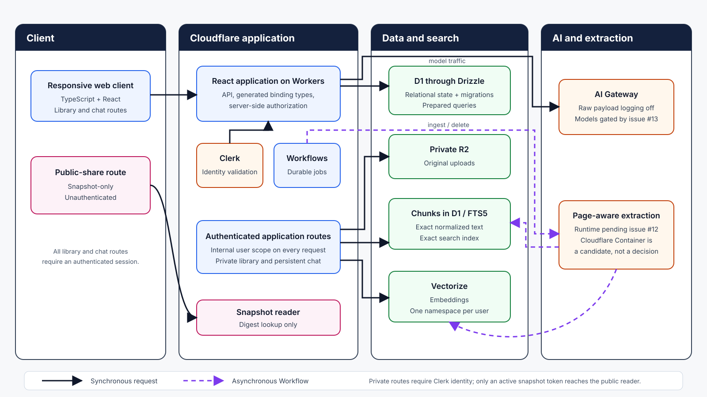
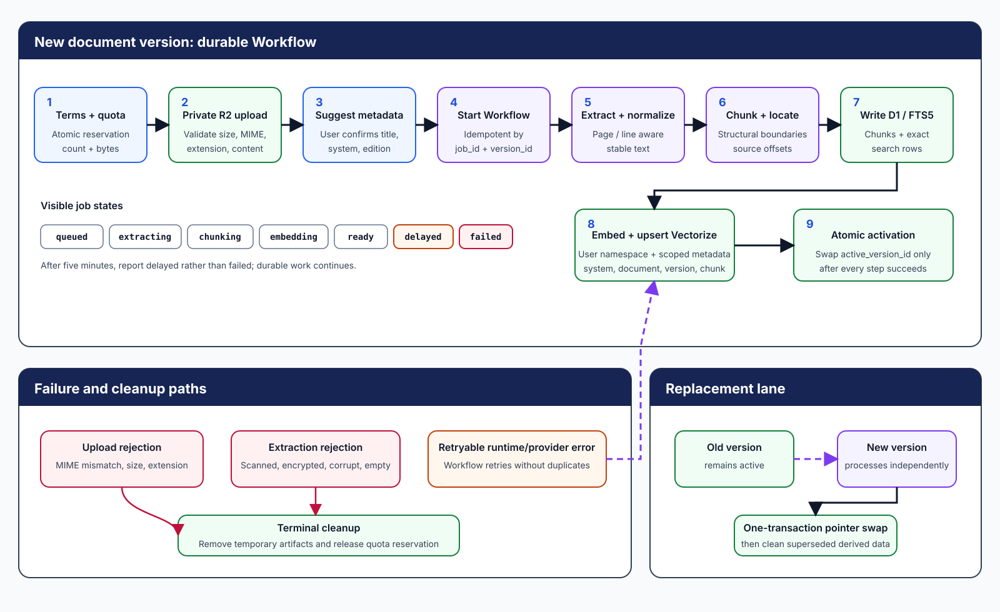
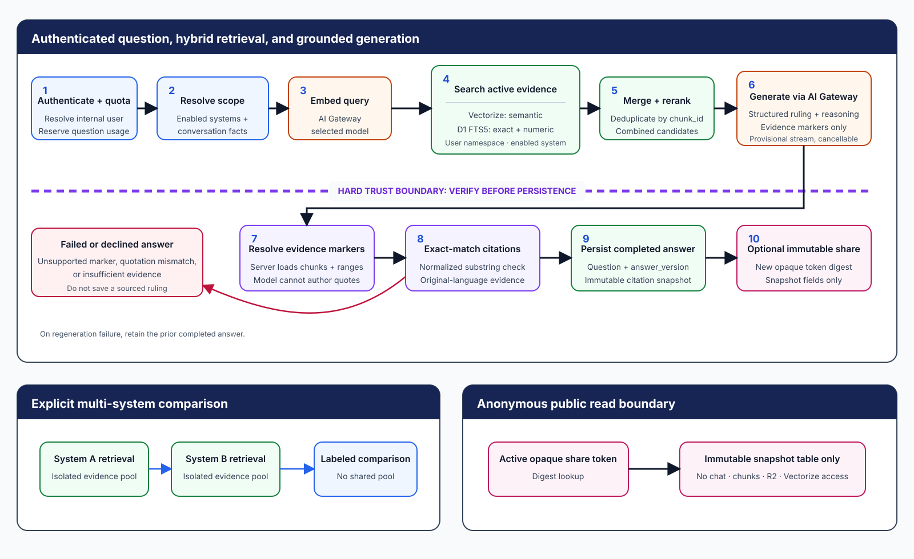

# Archive target architecture

> **Status:** This document describes the target architecture for the
> invite-only minimum viable product (MVP).
> [PDF extraction issue #12](https://github.com/SirPedr/archive/issues/12) and
> [retrieval-augmented generation (RAG) and model-selection issue #13](https://github.com/SirPedr/archive/issues/13)
> remain blocking validation gates. No runtime, model, resource, migration, or
> deployment described here should be treated as already implemented.

## Architecture invariants

- Every private record, object, and search request is scoped from the
  authenticated Clerk identity to one internal user ID.
- Answers use only evidence retrieved from currently enabled systems and active
  document versions.
- The model selects evidence, but the server materializes and verifies exact
  quotations from stored chunks.
- Original uploads remain private. A public share contains only its immutable
  answer snapshot and cited excerpts.
- Logs contain opaque IDs, state, timing, counts, and redacted errors. They
  never contain questions, answers, excerpts, extracted text, or original files.
- Account and chat deletion revoke affected public links before asynchronous
  cleanup begins.

## System overview

Archive separates authenticated application traffic, durable background work,
private source storage, retrieval indexes, model access, and anonymous snapshot
reads. The application derives every private data boundary from the
server-resolved internal user ID.



| Component        | Responsibility                                                                           | Boundary                                                                                                         |
| ---------------- | ---------------------------------------------------------------------------------------- | ---------------------------------------------------------------------------------------------------------------- |
| Web              | Cloudflare-native TypeScript React application                                           | [Issue #8](https://github.com/SirPedr/archive/issues/8) validates the current vinext default before scaffolding. |
| Identity         | Clerk allowlist, sessions, and external identity lifecycle                               | The server validates identity before resolving an internal user.                                                 |
| Application/API  | Cloudflare Workers runtime with generated binding types and server-side authorization    | Private handlers derive ownership scope and reject client-provided owner scope.                                  |
| Relational state | Cloudflare D1 accessed through Drizzle migrations and prepared queries                   | D1 holds authoritative application state and transactional pointers.                                             |
| Original files   | Private Cloudflare R2 objects addressed only by server-generated keys                    | Browsers never choose keys or receive public object URLs.                                                        |
| Durable jobs     | Cloudflare Workflows for ingestion, replacement, deletion, and retryable cleanup         | Workflow steps use durable IDs and remain safe to retry.                                                         |
| Exact search     | D1 full-text search version 5 (FTS5)                                                     | Search uses the same user, system, and active-version scope as semantic retrieval.                               |
| Semantic search  | One Vectorize index with one namespace per internal user                                 | Metadata filters restrict results to enabled systems and active document versions.                               |
| Model routing    | AI Gateway with raw payload logging disabled                                             | Provider and model versions remain subject to [issue #13](https://github.com/SirPedr/archive/issues/13).         |
| Extraction       | Page-aware runtime selected by [issue #12](https://github.com/SirPedr/archive/issues/12) | A Cloudflare Container is a candidate, not a documented fact.                                                    |

## Identity and authorization

Every private request crosses the same server-side authorization boundary:

1. Validate the Clerk session on the server.
2. Resolve the immutable internal `users.id`. Generate internal entity
   identifiers as UUID version 4 text with `crypto.randomUUID()`.
3. Derive D1 predicates, R2 prefixes, and the Vectorize namespace from that
   internal ID. Never accept a client-provided user ID or namespace as
   authorization.
4. Read the single operator Clerk user ID from deployment configuration. Do not
   store mutable operator roles in D1.
5. Permit anonymous access only to active public-share snapshot IDs.

Public share identifiers follow a separate scheme. Generate at least 128 bits of
cryptographic randomness, place the opaque token in the URL, and store only its
SHA-256 digest in D1. Unknown and revoked tokens return the same not-found
response.

## Data model

| Entity               | Purpose                                                   | Owner key                         | Critical invariants                                                                      |
| -------------------- | --------------------------------------------------------- | --------------------------------- | ---------------------------------------------------------------------------------------- |
| `users`              | Internal identity root and lifecycle state                | `id`                              | One immutable internal ID maps to one Clerk identity.                                    |
| `terms_acceptances`  | Versioned proof of accepted terms                         | `user_id`                         | Acceptance records are append-only and include the accepted terms version and timestamp. |
| `systems`            | User-defined rules systems and editions                   | `user_id`                         | Names need only be unique within the owner scope.                                        |
| `documents`          | Stable logical rulebook record                            | `user_id`                         | `active_version_id` may reference only a completely indexed owned version.               |
| `document_versions`  | Immutable upload and processing generation                | `user_id`                         | State transitions and replacement lineage remain explicit.                               |
| `ingestion_jobs`     | Durable ingestion and cleanup progress                    | `user_id`                         | `job_id` and `version_id` make each step idempotent.                                     |
| `chunks`             | Normalized source text and source locations               | `user_id`                         | Chunks belong to one document version and preserve exact source offsets.                 |
| `chunks_fts`         | Rebuildable FTS5 virtual table                            | Derived owner scope               | Rows mirror searchable chunks and never become authoritative source data.                |
| `chats`              | Persistent private conversation                           | `user_id`                         | Deleting a chat revokes its shares before removing private state.                        |
| `chat_systems`       | Enabled systems for a chat                                | Through `chats.user_id`           | Retrieval may use only enabled, owned systems.                                           |
| `messages`           | User questions and completed assistant message references | Through `chats.user_id`           | A generated answer is linked only after validation completes.                            |
| `answer_versions`    | Immutable completed ruling and reasoning snapshots        | `user_id`                         | Regeneration creates a new version and never mutates a published snapshot.               |
| `citations`          | Immutable evidence excerpts and locations                 | Through `answer_versions.user_id` | Quotation text comes from verified stored chunks, not model prose.                       |
| `shares`             | Public snapshot and revocation state                      | `user_id`                         | D1 stores only the token digest; each token identifies one immutable snapshot.           |
| `usage_buckets`      | Atomic counters for configured periods and ceilings       | `user_id`, or global scope        | Mutations reserve capacity before work starts and fail closed at the limit.              |
| `usage_reservations` | Pending document-count and byte claims                    | `user_id`                         | Cancellation, rejection, and terminal failure release each reservation once.             |
| `runtime_config`     | Operator-controlled limits and feature switches           | Global singleton                  | Only the configured operator may mutate settings.                                        |
| `audit_events`       | Security and lifecycle event metadata                     | `user_id` when applicable         | Events contain opaque identifiers and redacted fields, never user content.               |

The relationships below carry the retrieval and lifecycle guarantees:

- `documents.active_version_id` points only to a completely indexed version.
- A replacement version processes independently and swaps into
  `active_version_id` in one D1 transaction. Failed replacements leave the old
  pointer unchanged.
- `chunks` store normalized exact text, language, structural heading path, PDF
  page index, printed page label when recoverable, Markdown line range when
  applicable, and source offsets.
- `answer_versions` and `citations` contain immutable evidence snapshots, so
  source deletion cannot mutate historical answers or public pages.
- FTS5 rows and Vectorize vectors are derived data. Cleanup or reconciliation
  may rebuild them from active chunks.

R2 keys never contain user filenames:

```text
users/{userId}/documents/{documentId}/versions/{versionId}/original.{pdf|md}
users/{userId}/jobs/{jobId}/...
```

The owner downloads an original through a short-lived, server-authorized
response. Public pages never receive an R2 key or download URL.

## Document ingestion and replacement

The ingestion Workflow keeps an upload private, reserves quota before accepting
work, and changes the active retrieval set only after every derived
representation succeeds.



1. Enforce one-time terms acceptance and server-side defaults of 25 MB per file,
   10 documents, 250 MB stored, and 50 questions per day. The operator may
   configure every value.
2. Reserve document count and bytes before issuing upload authority. Release the
   reservation on cancellation, rejection, or terminal failure.
3. Accept only text-based PDF and Markdown. Reject scanned or image-only,
   encrypted, corrupt, empty, extension/MIME-mismatched, and oversized files
   with specific user-facing reasons.
4. Store the original privately, extract stable page-aware or line-aware
   normalized text, and ask the user to confirm the suggested title, system, and
   edition before indexing.
5. Chunk on structural boundaries while retaining stable source offsets and
   locations.
6. In one Workflow, write chunks, update FTS5, create embeddings, upsert vectors
   into the user namespace with `system_id`, `document_id`, `version_id`, and
   `chunk_id` metadata, and activate only after every step succeeds.
7. Mark work beyond five minutes as `delayed` without declaring failure. Make
   every step idempotent by `job_id` and `version_id`, so retries cannot
   duplicate derived data.
8. For replacement, keep the old active version searchable until the new version
   is completely indexed. Then swap the pointer and remove superseded derived
   data while retaining saved answer snapshots.

## Question and answer flow

The answer path combines semantic and exact retrieval, treats model output as
provisional, and crosses a verification boundary before it can become a
completed answer or public snapshot.



- **System resolution:** Resolve one enabled system automatically. With several
  enabled systems, use an explicitly named system or an unambiguous system
  established by the immediately preceding ruling. Otherwise, ask which system.
  A named disabled system produces enablement guidance. Explicit comparisons run
  isolated retrieval once per named enabled system.
- **Hybrid retrieval:** Query Vectorize inside the internal-user namespace and
  filter to enabled `system_id` values and active versions. Query D1 FTS5 over
  the same scope for names, exact phrases, and numbers. Merge by `chunk_id`,
  deduplicate, and rerank the combined candidates.
- **Model boundary:** Send only current conversational facts and selected
  evidence to the model through AI Gateway. Providers must offer no-training
  application programming interface (API) terms and minimal operational
  retention. Raw gateway payload logging stays disabled.
- **Structured result:** Require model output with a direct rules-as-written
  ruling, reasoning, and evidence markers that include chunk IDs and source
  ranges. The model does not supply authoritative quotation text or file
  locations.
- **Streaming and verification:** Stream provisional ruling and reasoning text
  with cancellation. Do not persist it or mark it publishable until evidence
  markers resolve and exact normalized substrings verify. Emit final citation
  cards after verification. On failure, terminate the provisional response with
  an error and retain the prior completed answer when regenerating.
- **Cross-language answers:** Answer in the question language, keep each exact
  quotation in its original language, and label any generated translation as a
  translation. Exact-match verification applies to the original text.
- **Insufficient or conflicting evidence:** When evidence remains insufficient
  after a focused clarification, decline and name the systems searched. When
  retrieved sources conflict, cite each passage and do not select a winner.
  General model knowledge and uncited table advice never fill gaps.
- **Persistence and regeneration:** Persist the user question and completed
  `answer_version` only after validation. Regeneration creates a new private
  answer version. Any existing published snapshot remains unchanged.

## Publishing and deletion semantics

| Action            | Public links and snapshots                                                                         | Private and retrieval data                                                                                                    |
| ----------------- | -------------------------------------------------------------------------------------------------- | ----------------------------------------------------------------------------------------------------------------------------- |
| Delete document   | Preserve immutable answer and share evidence snapshots.                                            | Remove the original and derived retrieval data.                                                                               |
| Replace document  | Existing snapshots remain unchanged.                                                               | Keep the old version active until atomic cutover; then remove its superseded derived data.                                    |
| Delete chat       | Revoke every share from the chat before deletion begins.                                           | Delete private chat state through durable, idempotent cleanup.                                                                |
| Revoke share      | Invalidate the opaque URL permanently and audit the action. Republishing creates a distinct token. | Keep the private answer unless another lifecycle action removes it.                                                           |
| Operator takedown | Invalidate the opaque URL permanently and audit the action. Republishing creates a distinct token. | Do not grant the operator access to owner content through the takedown path.                                                  |
| Delete account    | Revoke every share before cleanup begins.                                                          | Durably and idempotently remove the Clerk identity, D1 private state, R2 objects, FTS5 rows, and Vectorize namespace content. |

Public pages expose the question, ruling, reasoning, system and edition, exact
excerpts, labeled translations, document titles, and best available locations.
They expose no owner identity, original document, R2 URL, or neighboring private
context. External links may cause search engines to index a page, but Archive
provides neither a sitemap entry nor an in-application public directory.

## Runtime configuration and quotas

D1-backed operator settings control maximum upload size, document count, stored
bytes, questions per period, the global artificial intelligence (AI) ceiling,
upload enablement, and question enablement. Atomic `usage_buckets` and
`usage_reservations` enforce those settings across concurrent requests.
Exhaustion fails closed with a clear message while existing reads and public
pages continue. Archive does not silently queue requests or switch models.

## Security and privacy

- Apply an ownership predicate derived from the authenticated internal user ID
  to every private D1 query.
- Generate R2 keys on the server and issue short-lived, owner-authorized
  download responses.
- Isolate Vectorize data with one namespace per internal user and filter every
  retrieval by enabled system and active version.
- Use prepared D1 queries for all user-influenced values.
- Treat uploaded text as untrusted data and prevent its instructions from
  changing system policy, evidence scope, tool access, or output validation.
- Apply cross-site request forgery (CSRF) protections appropriate to Clerk
  session-backed mutation routes.
- Give public pages a restrictive Content Security Policy (CSP) and no access to
  private application APIs.
- Validate file size, extension, MIME type, structure, extraction result, and
  supported text content before activation.
- Return identical not-found behavior for unknown and revoked share tokens.

## Observability

Structured events may record an event name plus `request_id`, `user_id_hash`,
`job_id`, `document_id`, `model`, `provider`, token counts, candidate counts,
state, duration, and a redacted error code. Events omit questions, answers,
excerpts, prompts, extracted text, filenames, original files, and raw provider
payloads. Audit events record lifecycle and operator actions with the same
content restrictions.

## Environments and deployment

Local and production are the only persistent environments. Local development
uses local emulation and local-only values. Production uses the explicitly named
`archive-production` Worker. The build generates Worker environment types from
checked-in binding configuration, and secrets remain in Cloudflare secret
facilities rather than source or versioned configuration.

Remote release validation uses an uploaded version of `archive-production` that
receives no production traffic. The release records the current live version,
uploads one tagged candidate, validates its versioned preview URL, and promotes
that exact version ID to 100 percent without rebuilding. A failed candidate
remains undeployed. Uploaded versions and their preview URLs remain
Cloudflare-managed history because individual version deletion and preview TTL
are unavailable.

Candidate resources introduced by later platform work must be isolated from
production data and named from opaque deployment identifiers rather than user
content. Rejected or promoted candidates clean up only disposable external
resources and replaceable aliases that expose a supported deletion operation.
Cleanup must never delete the production Worker or weaken ownership, privacy,
revocation, or document-version invariants.

Rollback explicitly targets the previously recorded known-good version. The
platform retains rollback access only for the 100 most recent published
versions, and Worker rollback does not revert bindings or resource data.
Database changes must therefore remain forward-compatible or provide a tested
forward repair. A rollback must not reactivate revoked shares or abandoned
document versions.

## Performance and capacity

The invite-only MVP targets 25 users. The default maximum upload is 25 MB. Valid
documents should usually become ready within five minutes. Answers should
usually begin within five seconds and finish within sixty seconds. Configurable
hard quotas bound capacity instead of unbounded queues.

## Decision gates

- [Issue #12: Prototype page-aware PDF extraction](https://github.com/SirPedr/archive/issues/12)
  must pass representative extraction quality, rejection, timing, and cleanup
  checks before [issue #22](https://github.com/SirPedr/archive/issues/22)
  implements production extraction. The final extraction runtime remains
  undecided until the issue records a result.
- [Issue #13: Build the multilingual RAG evaluation harness and select models](https://github.com/SirPedr/archive/issues/13)
  must pass multilingual accuracy, exact-citation, prompt-injection, latency,
  retention, and cost checks before
  [issue #23](https://github.com/SirPedr/archive/issues/23),
  [issue #29](https://github.com/SirPedr/archive/issues/29), or
  [issue #30](https://github.com/SirPedr/archive/issues/30) locks a
  model-dependent format. Embedding, generation, and reranking selections remain
  undecided until the issue records them.

## Delivery map

| Architecture area                                                 | Delivery epic                                                                                 |
| ----------------------------------------------------------------- | --------------------------------------------------------------------------------------------- |
| Runtime foundation, storage, extraction and model gates           | [#1 Platform foundation and architecture gates](https://github.com/SirPedr/archive/issues/1)  |
| Identity, terms, account settings, and account deletion           | [#2 Identity, onboarding, and account lifecycle](https://github.com/SirPedr/archive/issues/2) |
| Systems, uploads, ingestion, replacement, and document lifecycle  | [#3 Private rulebook library and ingestion](https://github.com/SirPedr/archive/issues/3)      |
| Chat, retrieval, grounded generation, citations, and regeneration | [#4 Persistent chat and grounded answer engine](https://github.com/SirPedr/archive/issues/4)  |
| Immutable public snapshots and revocation                         | [#5 Publishing and public answer pages](https://github.com/SirPedr/archive/issues/5)          |
| Quotas, operator configuration, and takedown                      | [#6 Usage controls and operator tools](https://github.com/SirPedr/archive/issues/6)           |
| Security, quality, recovery, and alpha readiness                  | [#7 Security, quality, and alpha release](https://github.com/SirPedr/archive/issues/7)        |

Track implementation status in the
[Archive GitHub Project](https://github.com/users/SirPedr/projects/5).
